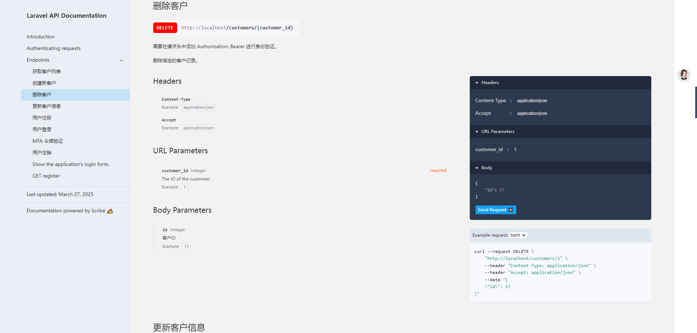
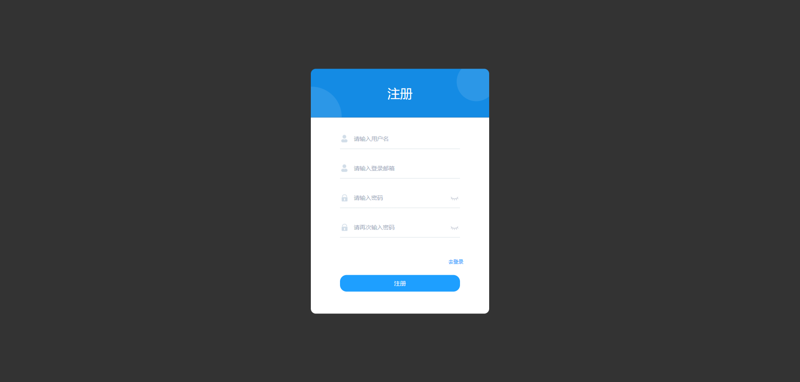
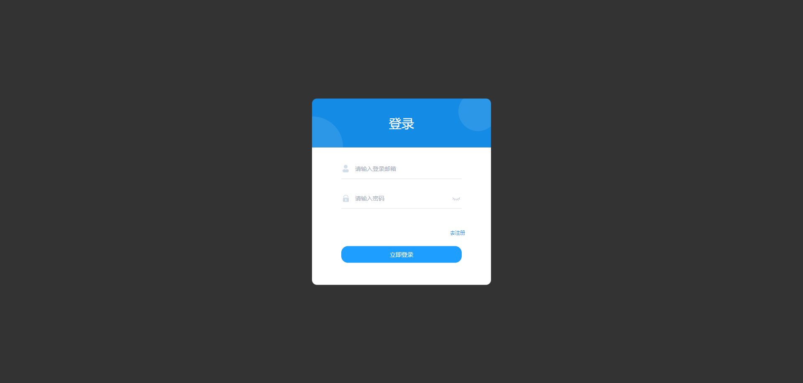
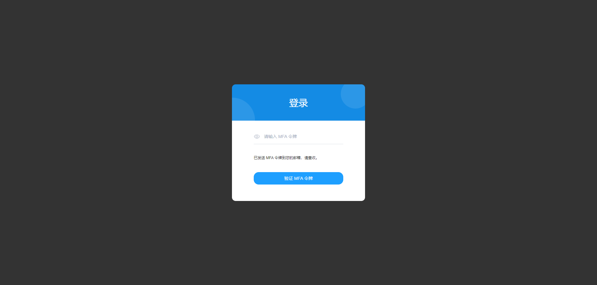
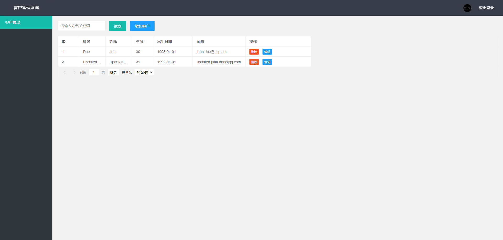
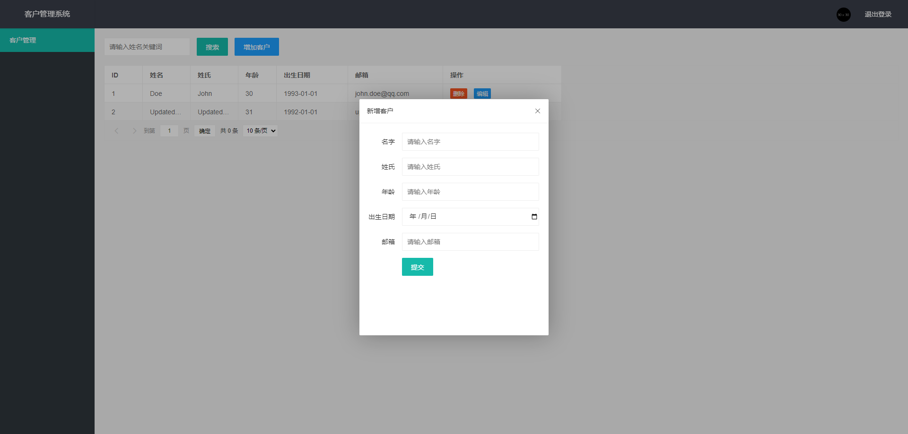

## 环境要求
- PHP 8.1+
- MySQL 8.0+
- Nginx 1.10+

## 安装及配置教程
1. 打开命令行克隆代码 `git clone https://github.com/panlinyu/laravel_test.git`
1. 命令行进入 `laravel_test` 目录, 执行 `composer install` 安装第三方包
1. 接着执行 `cp .env.example .env` 创建配置文件
1. 接着执行 `php artisan key:generate` 生成 Laravel 应用的加密密钥
1. 接着执行 `php artisan passport:keys` 生成 Passport 所需的 RSA 密钥对
1. 接着执行 `php artisan passport:client --password` 创建一个 OAuth2 密码授权客户端
1. 配置 `.env` 文件中的数据库信息以及邮件驱动配置信息，邮件配置可使用（或修改为自己的）：
```
MAIL_MAILER=smtp
MAIL_HOST=smtp.qq.com
MAIL_PORT=587
MAIL_USERNAME=pan-lin-yu@foxmail.com
MAIL_PASSWORD=yrytgsyvmvqxibae
MAIL_ENCRYPTION=SSL
MAIL_FROM_ADDRESS="pan-lin-yu@foxmail.com"
MAIL_FROM_NAME="${APP_NAME}"
```
- 接着执行 `php artisan migrate` 执行数据库迁移

## 使用教程
1. 命令行执行 `php artisan serve` 启动内置的开发服务器或使用`Nginx`将项目文件夹下的 `public` 设置为网站根目录
```
app/
└── Http/
    └── Controllers/
        ├── Auth/
        │   ├── LoginController.php 登录控制器
        │   └── RegisterController.php 注册控制器
        └── CustomerController.php 客户管理控制器
```

## scribe 生成API文档
1. 命令行执行 `php artisan scribe:generate` 生成API文档
1. 访问 `http://localhost:8000/api/docs` 查看API文档


## 测试用例说明
- `tests/Feature/RegistrationAndLoginTest.php` 用于测试用户注册和登录功能
- `tests/Feature/CustomersTest.php` 中包含了六个测试用例
    - `testIndex` 方法用于测试：认证用户能否成功访问客户列表页面
    - `testCreate` 方法用于测试：认证用户能否成功创建客户
    - `testList` 方法用于测试：认证用户能否成功获取客户列表
    - `testCreateWithValidationErrors` 方法用于测试：认证用户创建客户时的表单验证逻辑是否正常工作
    - `testUpdate` 方法用于测试：认证用户能否成功更新客户信息
    - `testDelete` 方法用于测试：认证用户能否成功删除客户
- 测试用例中使用了 `assertStatus` 和 `assertJson` 方法来断言 HTTP 响应的状态码和响应内容
- 命令行执行 `php artisan test` 运行测试用例

## UI页面步骤
1. 注册页面

1. 登录页面

1. MFA验证页面

1. 客户列表页面

1. 编辑/创建客户页面

